```{r}
#| echo: false
source(".Rprofile")
```

## {background-image="intro_to_tidymodels.png" background-size="contain" background-color="black"}

## Agenda

<br><br>

1. About Me
2. Data Science Issues
3. Intro to Tidymodels
4. Intro to Positron
5. Live Demo

# About Me {background-color=''}

## Professional Background

💼 __Career__  
|- [EY](https://www.ey.com) - Manager, Valuation, Modeling, & Economics  
|- [PG&E](https://www.pgecorp.com) - Supervisor, Capital Recovery & Analysis  
|- [KPMG](https://www.kpmg.us) - Sr Manager, Economics & Valuation  
|- [Centene](https://www.centene.com) - Data Scientist III, Strategic Insights  
|- [Bloomreach](https://www.bloomreach.com) - Sr Manager, Data Ops & Analytics  
|- [Centene](https://www.centene.com) - Lead Machine Learning Engineer  
<br>
📚 __Education__<br>
|- [Georgia Tech](https://www.gatech.edu) - BS Management  
|- [UC Irvine](https://uci.edu) - MS Business Analytics  

::: footer
Personal Site: [JavierOrracaDeatcu.com](https://www.javierorracadeatcu.com/) | LinkedIn: [linkedin.com/in/orraca](https://www.linkedin.com/in/orraca/)
:::

## Technical Skills Gained

💼 __Career__  
|- [EY](https://www.ey.com) - Microsoft Excel, Microsoft Access, Financial Modeling  
|- [PG&E](https://www.pgecorp.com) - SQL, ODBC (connecting Access / Excel to EDWs)  
|- [KPMG](https://www.kpmg.us) - VBA scripting, Excel add-ins (Power Query and Power BI)  
|- [Centene](https://www.centene.com) - R, Web Apps, Package Dev, ML / AI, Cloud DS Tools  
|- [Bloomreach](https://www.bloomreach.com) - GCP, Amazon Redshift, Linux, Google Workspaces  
|- [Centene](https://www.centene.com) - Docker, k8s, Databricks, Linux, bash, GenAI + LLMs   
<br>
📚 __Education__<br>
|- [Georgia Tech](https://www.gatech.edu) - Finance, Business Management  
|- [UC Irvine](https://uci.edu) - Business Analytics, Data Science  

::: footer
Personal Site: [JavierOrracaDeatcu.com](https://www.javierorracadeatcu.com/) | LinkedIn: [linkedin.com/in/orraca](https://www.linkedin.com/in/orraca/)
:::

# Data Science Issues {background-color=''}

## AI... It's an umbrella

{fig-align="center"}

::: footer
Image credit: <https://vas3k.com/blog/machine_learning>
:::

## AI... It's a _growing_ umbrella

{fig-align="center"}

::: footer
Image credit: <https://vas3k.com/blog/machine_learning>
:::

## Classical ML... _Another_ umbrella

{fig-align="center"}

::: footer
Image credit: <https://vas3k.com/blog/machine_learning>
:::

## ML Issues

- How should I measure my baseline?

- Which ML algorithm(s) should I use?

- How should I split my training and testing data?

- How should I evaluate my model fit?

- Which performance evaluation metric(s) should I use?

- Every ML package has a unique set functions and arguments

## {.center}

::: r-fit-text
and the most annoying issue...
:::

## {.center background-color="black"}

::: r-fit-text
data
:::

## {.center background-color="black"}

::: r-fit-text
sucks!
:::

## Data sucks!

- Missing data (NAs, nulls, etc.)
  - You may need to impute missing values

. . .

- Categorical variables
  - ML algorithms might require dummy or one-hot encoding

. . .

- Data type issues
  - For example, character strings and numbers in the same column

. . .

- Too many variables

# Intro to Tidymodels {background-color=''}

## What is Tidymodels?

{width="80%" height="80%" fig-align="center"}

::: footer
Learn more about Tidymodels at [tidymodels.org](https://www.tidymodels.org)
:::

## What is Tidymodels?

- A collection of [R packages for reproducible ML]{.fragment .highlight-red}
<br><br>
- Follows tidy principles:
  - Consistent interface
  - Human-readable code
  - Reproducible workflows
<br><br>
- Provides a [unified syntax for ML]{.fragment .highlight-red}

::: footer
Learn more about Tidymodels at [tidymodels.org](https://www.tidymodels.org)
:::

## The ML Workflow (with Tidymodels)

{width="90%" height="90%" fig-align="center"}

::: footer
Image credit: Chen Xing's [Tidymodels Ecosystem Tutorial](https://rpubs.com/chenx/tidymodels_tutorial)
:::

## Let's Build a Binary Classification Model! {.smaller}

<br><br>

**Our tidymodels workflow will follow the steps below:**

<br><br>

:::: {.columns}
::: {.column width="50%"}
  0. Load libraries & data
  1. Split data
  2. Create recipe
  3. Specify model
  4. Create workflow
  5. Train model
  6. Evaluate performance
  7. Visualize performance
:::

::: {.column width="50%"}
  8. Setup for tuning
  9. Create CV folds
  10. Define the tuning grid
  11. Tune the model
  12. Visualize tuning results
  13. Select the best model
  14. Final fit
  15. Variable importance
:::
::::

## The Big Picture: Logistic Regression {.smaller}

<br><br>

* **Logistic regression** is a statistical method that uses the logistic (or "sigmoid") function to model the probability of a binary outcome based on independent (or "predictor") variables

* Our logistic regression problem: **Predict the survival of Titanic passengers**:
  * The binary target variable is `Survived`
    * 0 = _did not survive_ the Titanic 😢
    * 1 = _survived_ the Titanic 🎉

* **The logistic function maps to an S-shaped curve** - In our Titanic example:
  * It shows how the probability of survival changes from low to high (or vice versa)
  * It illustrates that there is a gradual transition between outcomes rather than a sudden jump

- **Age is one of the independent variables** we'll use to predict a passenger's likelihood to survive

## The Big Picture: Logistic Regression

```{r}
#| echo: false

# Sample dataset: simulated binary outcome based on predictor x
set.seed(123)
n <- 50
x <- seq(-10, 10, length.out = n)
# Generate probabilities using the logistic function
prob <- 1 / (1 + exp(-x))
# Create binary outcomes using the probabilities
y <- rbinom(n, size = 1, prob = prob)
data <- data.frame(x = x, y = y)

library(ggplot2)
ggplot(data, aes(x = x, y = y)) +
  geom_point(alpha = 0.6, color = "red") + 
  stat_smooth(method = "glm", 
              method.args = list(family = "binomial"), 
              se = FALSE, color = "blue") +
  labs(title = "Titanic Survival Probability by Age",
       x = "Predictor: Age",
       y = "Probability of Survival") +
  scale_x_continuous(breaks = c(-10, -5, 0, 5, 10),
                     labels = c("80", "60", "40", "20", "0"))
```

## The Big Picture: log reg with `glm()`

:::: {.columns}

::: {.column width="49%"}

*base R's `glm()`*

```{r}
#| eval: false
#| echo: true

# Convert certain variables to factors to treat as categorical
titanic$Survived <- as.factor(titanic$Survived)
titanic$Pclass <- as.factor(titanic$Pclass)
titanic$Sex <- as.factor(titanic$Sex)

# Impute missing values for Age and Fare with their respective means
titanic$Age[is.na(titanic$Age)]   <- mean(titanic$Age, na.rm = TRUE)
titanic$Fare[is.na(titanic$Fare)] <- mean(titanic$Fare, na.rm = TRUE)

# Fit the logistic regression model
titanic_fit <- glm(Survived ~ Pclass + Sex + Age + SibSp + Parch + Fare, 
                   data = titanic, 
                   family = binomial)
```

:::

::: {.column width="2%"}
:::

::: {.column width="49%"}

*tidymodels `set_engine("glm")`*

```{r}
#| eval: false
#| echo: true

# Convert relevant variables to factors
titanic <- titanic |> 
  mutate(Survived = factor(Survived))

# Setup recipe
titanic_recipe <- recipe(Survived ~ Pclass + Sex + Age + SibSp + Parch + Fare, 
                         data = titanic) |> 
  step_impute_mean(all_numeric_predictors()) |> 
  step_dummy(all_nominal_predictors())

# Setup model specification and workflow pipeline
titanic_spec <- logistic_reg() |> 
  set_engine("glm") |> 
  set_mode("classification")

titanic_workflow <- workflow() |> 
  add_recipe(titanic_recipe) |> 
  add_model(titanic_spec)

titanic_fit <- titanic_workflow |> 
  fit(data = titanic)
```
:::

::::

## The Big Picture: log reg with `{glmnet}`

:::: {.columns}

::: {.column width="49%"}

*R's `{glmnet}`*

```{r}
#| eval: false
#| echo: true

# Convert certain variables to factors to treat as categorical
titanic$Survived <- as.factor(titanic$Survived)
titanic$Pclass <- as.factor(titanic$Pclass)
titanic$Sex <- as.factor(titanic$Sex)

# Impute missing values for Age and Fare with their respective means
titanic$Age[is.na(titanic$Age)]   <- mean(titanic$Age, na.rm = TRUE)
titanic$Fare[is.na(titanic$Fare)] <- mean(titanic$Fare, na.rm = TRUE)

# Create a design matrix for predictors
### model.matrix() automatically handles factors by creating dummy variables
### Remove the intercept column (first column) with [,-1] because {glmnet} includes it by default
x <- model.matrix(Survived ~ Pclass + Sex + Age + SibSp + Parch + Fare,
                  data = titanic)[, -1]

# Create the response vector
y <- titanic$Survived

# Fit the logistic regression model using glmnet (for a range of lambda values)
glmnet_fit <- glmnet(x, y, family = "binomial")
```

:::

::: {.column width="2%"}
:::

::: {.column width="49%"}

*tidymodels `set_engine("glmnet")`*

```{r}
#| eval: false
#| echo: true

# Convert relevant variables to factors
titanic <- titanic |> 
  mutate(Survived = factor(Survived))

# Setup recipe
titanic_recipe <- recipe(Survived ~ Pclass + Sex + Age + SibSp + Parch + Fare, 
                         data = titanic) |> 
  step_impute_mean(all_numeric_predictors()) |> 
  step_dummy(all_nominal_predictors())

# Setup model specification and workflow pipeline
titanic_spec <- logistic_reg() |> 
  set_engine("glmnet") |> 
  set_mode("classification")

titanic_workflow <- workflow() |> 
  add_recipe(titanic_recipe) |> 
  add_model(titanic_spec)

titanic_fit <- titanic_workflow |> 
  fit(data = titanic)
```
:::

::::

## Step 0: Load Libraries & Data {auto-animate="true"}

```{r}
#| echo: true
#| eval: false
#| code-line-numbers: "1-10|9"

# Load necessary packages
library(tidyverse)
library(tidymodels)
library(titanic)

# Load and prepare data
data(titanic_train)
titanic_data <- as_tibble(titanic_train) |> 
  mutate(Survived = factor(Survived, levels = c(0, 1)))

```

## Step 0: Load Libraries & Data {auto-animate="true"}

```{r}
#| echo: true

# Load necessary packages
library(tidyverse)
library(tidymodels)
library(titanic)

# Load and prepare data
data(titanic_train)
titanic_data <- as_tibble(titanic_train) |> 
  mutate(Survived = factor(Survived, levels = c(0, 1)))  # Convert target variable to a factor level

# Take a look at the data
glimpse(titanic_data)
```

## Step 1a: Split the Data

```{r}
#| echo: true

# Split the data (create a singular object containing training and testing splits)
set.seed(123)
titanic_split <- initial_split(
  data = titanic_data, 
  prop = 0.75, 
  strata = Survived # stratify split by Survived column
)

# Create training and testing datasets
train_data <- training(titanic_split)
test_data <- testing(titanic_split)
```

## Step 1b: Take a `glimpse()` at the splits

```{r}
#| echo: true

# Use dplyr::glimpse() to review the training split
glimpse(train_data)
```

## Step 1c: Check the Stratification

```{r}
#| echo: true

# Review the proportion of 0s and 1s in each split
train_data |> 
  summarise(Train_Rows = n(), .by = Survived) |> 
  mutate(Train_Percent = Train_Rows / sum(Train_Rows)) |> 
  left_join(test_data |> 
    summarise(Test_Rows = n(), .by = Survived) |> 
    mutate(Test_Percent = Test_Rows / sum(Test_Rows)),
  join_by(Survived))
```

## Step 2: Create a Modeling Recipe

```{r}
#| echo: true

# Create a pre-processing recipe
titanic_recipe <- recipe(Survived ~ Pclass + Sex + Age + SibSp + Parch + Fare, 
                         data = train_data) |>
  step_impute_median(all_numeric_predictors()) |>         # Handle missing values in Age
  step_dummy(all_nominal_predictors()) |>  # Convert categorical variables to dummy variables
  step_normalize(all_numeric_predictors()) # Normalize numeric predictors

titanic_recipe
```

## Step 3: Specify the Model

With `{parsnip}`, you have a unified interface for ML:

```{r}
#| echo: true

# Specify a logistic regression model
log_model <- logistic_reg() |>
  set_engine("glm") |>
  set_mode("classification")

log_model
```

## Step 4: Create a Workflow

```{r}
#| echo: true

# Create a workflow
titanic_workflow <- workflow() |>
  add_recipe(titanic_recipe) |>
  add_model(log_model)

titanic_workflow
```

## Step 5: Train the Model

```{r}
#| echo: true

# Fit the workflow to the training data
titanic_fit <- titanic_workflow |> 
  last_fit(
    split = titanic_split, 
    metrics = metric_set(roc_auc, accuracy)
  )

titanic_fit
```

## Step 6: Evaluate the Model

```{r}
#| echo: true

# Collect metrics from the `last_fit()` model object
collect_metrics(titanic_fit)
```

## Step 7: Visualize Model Performance

```{r}
#| echo: true

# Plot confusion matrix
titanic_fit |>
  collect_predictions() |> 
  conf_mat(truth = Survived, estimate = .pred_class) |> 
  autoplot(type = "heatmap")
```

## Step 8: Hyperparameter Tuning

Let's try modeling with `{glmnet}` and tuning

```{r}
#| echo: true

# Create a tunable model specification
log_model_tune <- logistic_reg(
  penalty = tune(),
  mixture = tune()
) |>
  set_engine("glmnet") |>
  set_mode("classification")

# Create a tuning workflow
tune_workflow <- workflow() |>
  add_recipe(titanic_recipe) |>
  add_model(log_model_tune)
```

## Step 9: Create Cross-Validation Folds

```{r}
#| echo: true


# Create cross-validation folds
set.seed(234)
titanic_folds <- vfold_cv(train_data, v = 5, strata = Survived)

titanic_folds
```

## Step 10: Define the Tuning Grid

```{r}
#| echo: true

# Create a grid of hyperparameters to try
log_grid <- grid_latin_hypercube(
  penalty(),
  mixture(),
  size = 100
)

log_grid
```

## Step 11: Tune the Model

```{r}
#| echo: true

# Tune the model
set.seed(345)
log_tuning_results <- tune_grid(
  tune_workflow,
  resamples = titanic_folds,
  grid = log_grid,
  metrics = metric_set(roc_auc, accuracy)
)

log_tuning_results
```

## Step 12: Visualize Tuning Results

```{r}
#| echo: true

# Show the best models
show_best(log_tuning_results, metric = "roc_auc")
```

## Step 12: Visualize Tuning Results (cont.)

```{r}
#| echo: true

# Create a visualization of the tuning results
autoplot(log_tuning_results)
```

## Step 13: Select the Best Model

```{r}
#| echo: true

# Select the best hyperparameters
best_params <- select_best(log_tuning_results, metric = "roc_auc")

best_params
```

```{r}
#| echo: true

# Finalize the workflow with the best parameters
final_workflow <- finalize_workflow(tune_workflow, best_params)
```

## Step 14: Final Fit

```{r}
#| echo: true

# Fit the final model to the entire training set and evaluate on test set
final_fit <- final_workflow |>
  last_fit(titanic_split)

# Get the metrics
collect_metrics(final_fit)
```

## Step 15: Variable Importance

```{r}
#| echo: true

# Extract the fitted workflow
fitted_workflow <- final_fit |>
  extract_workflow()

# Extract the fitted model
fitted_model <- fitted_workflow |>
  extract_fit_parsnip()

# Calculate variable importance
vip::vip(fitted_model)
```

## Tidymodels Benefits

- **Consistent Interface**: Same syntax across different ML algorithms
- **Modularity**: Each step is a separate function that can be modified
- **Reproducibility**: Workflows capture the entire modeling process
- **Extensibility**: Easy to add new steps or algorithms
- **Visualization**: Built-in tools for visualizing results
- **Tuning**: Streamlined process for hyperparameter optimization

# Intro to Positron {background-color=''}

## A History of IDEs & Notebooks: RStudio

<br>

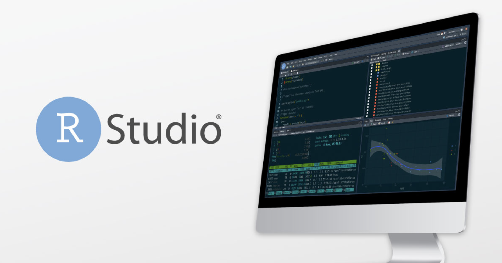{height="70%" width="70%" fig-align="center"}

::: footer
Learn more about the open-source RStudio IDE | <https://posit.co/products/open-source/rstudio>
:::

## A History of IDEs & Notebooks: RStudio

{height="55%" width="55%" fig-align="center"}

::: footer
RStudio User Guide | <https://docs.posit.co/ide/user/ide/get-started>
:::

## A History of IDEs & Notebooks: VS Code

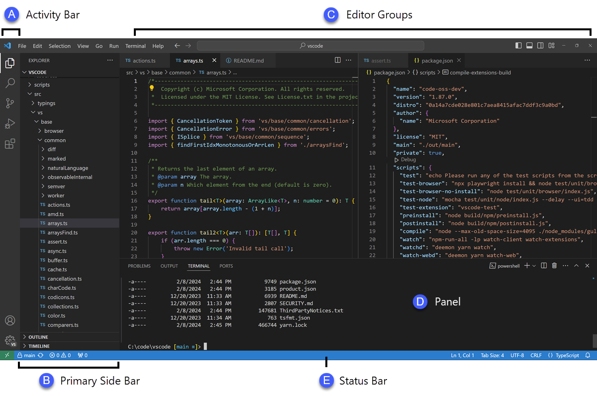{height="65%" width="65%" fig-align="center"}

::: footer
Learn about Microsoft's Virtual Studio Code ("VS Code") User Interface | <https://code.visualstudio.com/docs/getstarted/userinterface>
:::

## A History of IDEs & Notebooks: Jupyter

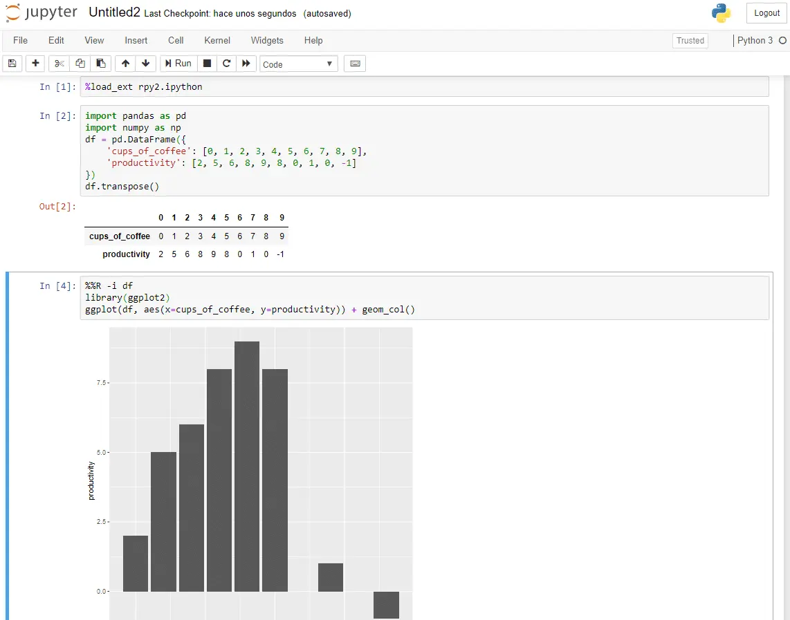{height="50%" width="50%" fig-align="center"}

::: footer
Image: © Ander Fernández Jauregui | Learn about Project Jupyter's [Jupyter Notebook](https://jupyter.org)
:::

## IDE Similarities & Differences

- RStudio IDE's "always on" panes welcomed R users seeking a data-analysis-first experience

- [For Python users, RStudio felt too R-centric]{.fragment .highlight-red} and other tools worked *just fine* including VS Code, Jupyter Notebooks, PyCharm, etc.

- There are many programming languages that can be used for data analysis, [but Python and R are the de facto standards for data science]{.fragment .highlight-red}

- There lacks a unifying IDE for Python _and_ R users

## Introducing Positron, *it looks familiar!*

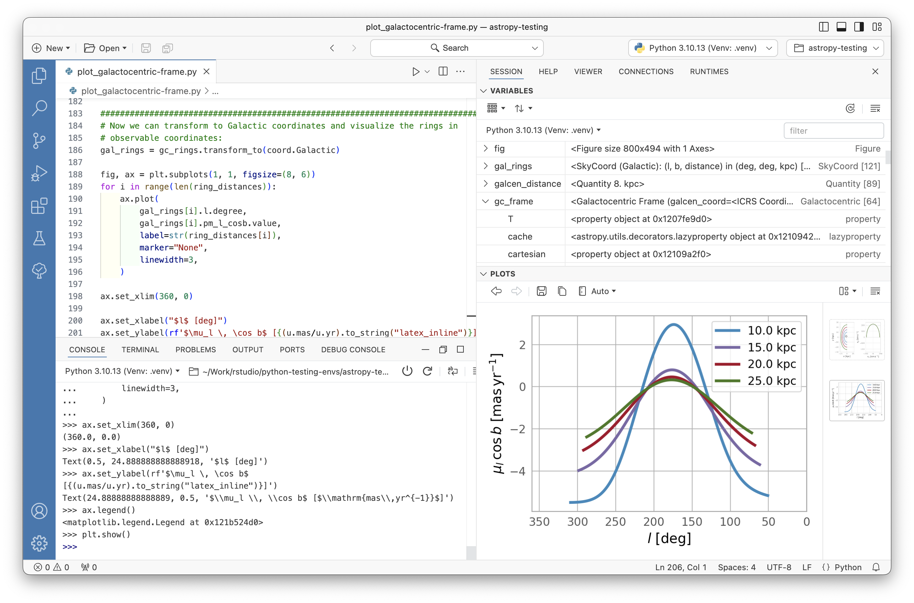{fig-align="center"}

::: footer
Visit the new Positron website to learn more | <https://positron.posit.co/>
:::


## About Positron

* What is Positron? From Posit's getting started docs:
  * A next-generation data science IDE built by Posit PBC
  * An extensible, polyglot tool for writing code and exploring data
  * A familiar environment for reproducible authoring and publishing

* Positron is [a tailor-made IDE for data science]{.fragment .highlight-red} built on top of [Code OSS](https://github.com/microsoft/vscode) that can be used with any combination of programming languages 

::: footer
Visit the new Positron website to learn more | <https://positron.posit.co/>
:::


## VS Code OSS w/ RStudio panes!

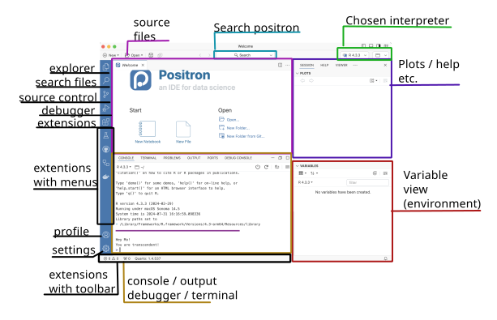{fig-align="center"}

::: footer
Layout by Dr. Athanasia Mo Mowinckel | [Positron IDE - A new IDE for data science](https://drmowinckels.io/blog/2024/positron/)
:::


## Prerequisites {.smaller}

<br>

- **Windows** prereqs:
  <br><br>
  - Ensure the latest [Visual C++ Redistributable](https://learn.microsoft.com/en-us/cpp/windows/latest-supported-vc-redist?view=msvc-170#latest-microsoft-visual-c-redistributable-version) is installed
  <br><br>
  - If you're an R user package developer, note that Positron doesn't currently bundle `Rtools`.
  <br><br>
  - For reference, `RTools` contains the required compilers needed to build R packages from source code on Windows

::: footer
Getting Started with Positron | [Machine Prerequisites](https://positron.posit.co/start.html)
:::


## Prerequisites {.smaller}

<br>

- **Python** prereqs:
  <br><br>
  - The Posit team recommends [pyenv](https://github.com/pyenv/pyenv) to manage Python versions, and Python versions from 3.8 to 3.12 are actively supported on Positron
  <br><br>
  - For Linux users, install the SQLite system libraries (`sqlite-devel` or `libsqlite3-dev`) ahead of time so `pyenv` can build your Python version(s) of choice
  <br><br>
  - Positron communicates with Python via the `ipykernel`
  <br><br>
  - If you're using `venv` or `conda` to manage your Python projects, you can install `ipykernal` manually as follows: `python3 -m pip install ipykernel`

::: footer
Getting Started with Positron | [Machine Prerequisites](https://positron.posit.co/start.html)
:::


## Prerequisites {.smaller}

<br>

- **R** prereqs:
  <br><br>
  - Positron requires R 4.2 or higher - To install R, follow the instructions for your OS at <https://cloud.r-project.org>
  <br><br>
  - If you’d like to have multiple R installations, [rig](https://github.com/r-lib/rig) is a great tool that works on macOS, Windows and Linux, and works well with Positron

::: footer
Getting Started with Positron | [Machine Prerequisites](https://positron.posit.co/start.html)
:::


## Interpreter Selector {.smaller}

<br>

:::: {.columns}

::: {.column width="60%"}
- When Positron starts for the first time in a new workspace (or project directory), it will start Python and/or R depending on your workspace characteristics
<br><br>
- In subsequent runs, [Positron will start the same interpreter(s) that was running the last time]{.fragment .highlight-red} that you used that workspace
<br><br>
- You can start, stop, and switch interpreters from the interpreter selector
:::

::: {.column width="40%"}
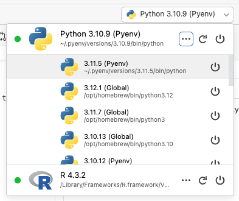{width="393px" height="330px" fig-align="center"}
:::

::::

::: footer
Getting Started with Positron | [Interpreter Selection](https://positron.posit.co/interpreters.html)
:::


## Key Bindings & Command Palette {.smaller}

- Key bindings trigger actions by pressing a combination of keys
- The key binding <kbd>Cmd</kbd>/<kbd>Ctrl</kbd>+<kbd>Shift</kbd>+<kbd>P</kbd> will bring up Positron's Command Palette
- This lets you search and execute actions without needing to remember the key binding

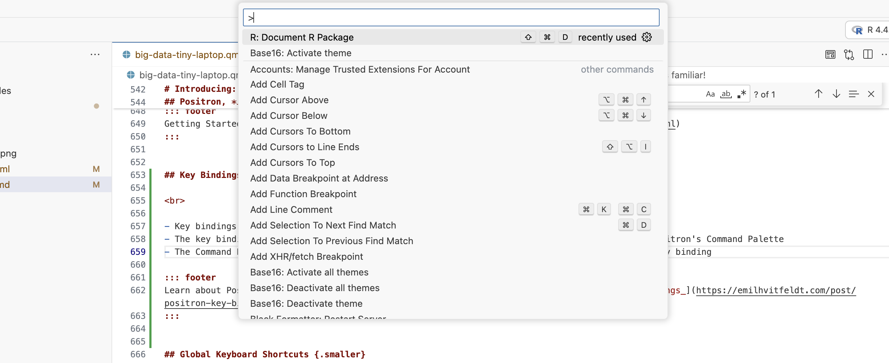{width="75%" height="75%" fig-align="center"}

<br>

::: footer
Learn more on Emil Hvitfeldt's blog post [Positron: My Key Bindings](https://emilhvitfeldt.com/post/positron-key-bindings/)
:::


## Global Keyboard Shortcuts {.smaller}

<br>

| Shortcut | Description |
| -------- | ----------- |
| <kbd>Cmd/Ctrl</kbd>+<kbd>Enter</kbd> | Run the selected code in the editor; if no code is selected, run the current statement | 
| <kbd>Cmd/Ctrl</kbd>+<kbd>Shift</kbd>+<kbd>0</kbd> | Restart the interpreter currently open in the Console | 
| <kbd>Cmd/Ctrl</kbd>+<kbd>Shift</kbd>+<kbd>Enter</kbd> | Run the file open in the editor (using e.g. `source()` or `%run`) | 
| <kbd>F1</kbd> | Show contextual help for the topic under the cursor |
| <kbd>Cmd/Ctrl</kbd>+<kbd>K</kbd>, <kbd>Cmd/Ctrl</kbd>+<kbd>R</kbd> | Show contextual help for the topic under the cursor (alternate binding) |
| <kbd>Cmd/Ctrl</kbd>+<kbd>K</kbd>, <kbd>F</kbd> | Focus the Console |
| <kbd>Ctrl</kbd>+<kbd>L</kbd> | Clear the Console |

::: footer
Positron docs | [Keyboard Shortcuts](https://positron.posit.co/keyboard-shortcuts.html)
:::


## R Keyboard Shortcuts {.smaller}

<br>

| Shortcut | Description |
| -------- | ----------- |
| <kbd>Cmd/Ctrl</kbd>+<kbd>Shift</kbd>+<kbd>M</kbd> | Insert the pipe operator (`|>` or `%>%`) | 
| <kbd>Alt</kbd>+<kbd>-</kbd> | Insert the assignment operator (`<-`) |
| <kbd>Cmd/Ctrl</kbd>+<kbd>Shift</kbd>+<kbd>L</kbd> | Load the current R package, if any | 
| <kbd>Cmd/Ctrl</kbd>+<kbd>Shift</kbd>+<kbd>B</kbd> | Build and install the current R package, if any | 
| <kbd>Cmd/Ctrl</kbd>+<kbd>Shift</kbd>+<kbd>T</kbd> | Test the current R package, if any | 
| <kbd>Cmd/Ctrl</kbd>+<kbd>Shift</kbd>+<kbd>E</kbd> | Check the current R package, if any | 
| <kbd>Cmd/Ctrl</kbd>+<kbd>Shift</kbd>+<kbd>D</kbd> | Document the current R package, if any | 

::: footer
Positron docs | [Keyboard Shortcuts](https://positron.posit.co/keyboard-shortcuts.html)
:::


## RStudio Keymap {.smaller}

<br>

If you're an experienced RStudio user, you can [easily set the RStudio keybindings]{.fragment .highlight-red} in the Positron settings:

- Open Positron's settings in the UI or the keystroke <kbd>Cmd/Ctrl</kbd>+<kbd>,</kbd>
- Search for "keymap", or navigate to *Extensions > RStudio Keymap*
- Check the "Enable RStudio key mappings for Positron" checkbox

::: footer
Positron docs | [Keyboard Shortcuts](https://positron.posit.co/keyboard-shortcuts.html)
:::


## Data Explorer Overview {.smaller}

<br>

- The new [Data Explorer allows for interactive exploration]{.fragment .highlight-red} of various types of dataframes using Python (`pandas`, `polars`) or R (`data.frame`, `tibble`, `data.table`, `polars`)
<br><br>
- The Data Explorer has three primary components
  - **Data grid**: Spreadsheet-like display of the data with sorting
  - **Summary panel**: Column name, type and missing data percentage for each column
  - **Filter bar**: Ephemeral filters for specific columns

::: footer
Positron docs | [Data Explorer](https://positron.posit.co/data-explorer.html)
:::


## Data Explorer Overview {.smaller}

<br>

- To use, navigate to the Variables Pane and click on the Data Explorer icon:

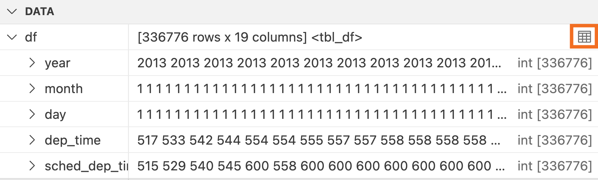{width="70%" height="70%" fig-align="center"}

::: footer
Positron docs | [Data Explorer](https://positron.posit.co/data-explorer.html)
:::


## Data Explorer Overview

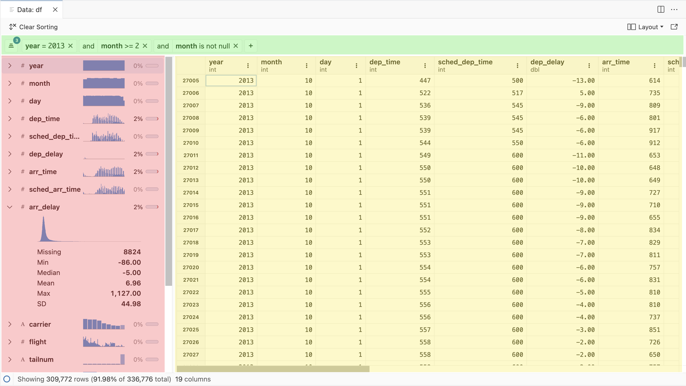{width="80%" height="80%" fig-align="center"}

::: footer
Positron docs | [Data Explorer](https://positron.posit.co/data-explorer.html)
:::


## Data Explorer's *Data Grid* {.smaller}

<br>

:::: {.columns}

::: {.column width="60%"}
- The data grid is the primary display and [scales efficiently]{.fragment .highlight-red} with large in-memory datasets up to millions of rows or columns
<br><br>
- At the top right of each column, there is a context menu that [controls sorting and filtering]{.fragment .highlight-red} in the selected column
:::

::: {.column width="5%"}
:::

::: {.column width="35%"}
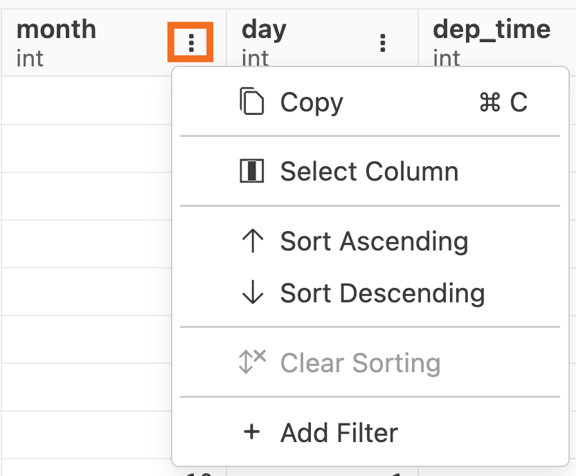{fig-align="center"}
:::

::::

::: footer
Positron docs | [Data Explorer](https://positron.posit.co/data-explorer.html)
:::


## Data Explorer's *Summary Panel* {.smaller}

<br>

:::: {.columns}

::: {.column width="60%"}
- Displays a vertical scrolling list of all columns in the data
<br><br>
- It [displays a sparkline histogram of that column’s data]{.fragment .highlight-red}, displays the amount of missing data, and shows some summary statistics about that column
<br><br>
- Double clicking on a column name will bring the column into focus in the data grid
:::

::: {.column width="40%"}
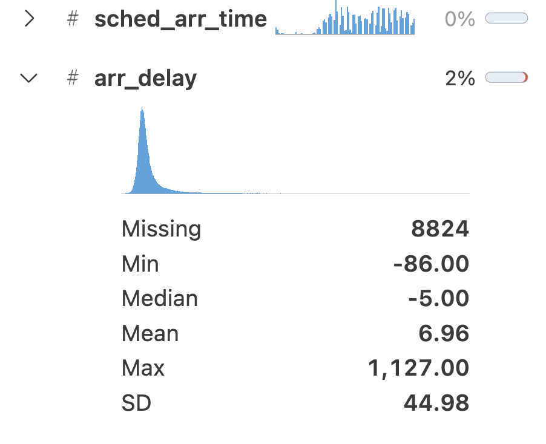{fig-align="center"}
:::

::::

::: footer
Positron docs | [Data Explorer](https://positron.posit.co/data-explorer.html)
:::


## Data Explorer's *Filter Bar* {.smaller}

<br>

:::: {.columns}

::: {.column width="40%"}
- The filter bar has controls to add filters, show/hide existing filters, or clear filters
<br><br>
- Clicking the <kbd>+</kbd> button quickly adds a new filter
<br><br>
- The status bar at the bottom of the Data Explorer also displays the percentage and number of remaining rows relative to the original total after applying a filter
:::

::: {.column width="60%"}
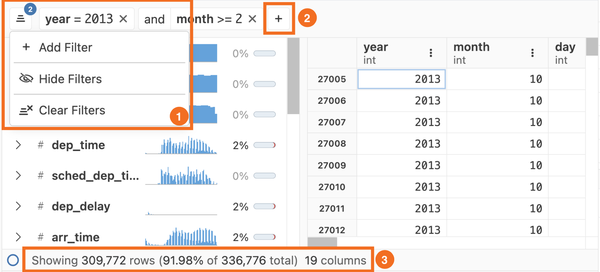{fig-align="center"}
:::

::::

::: footer
Positron docs | [Data Explorer](https://positron.posit.co/data-explorer.html)
:::


## Connections Pane {.smaller}

:::: {.columns}

::: {.column width="35%"}
<br>
- [Explore database connections]{.fragment .highlight-red} established with ODBC drivers or packages
<br><br>
- For Python users, the `sqlite3` and `SQLAlchemy` packages are supported
<br><br>
- For R users, the `odbc`, `sparklyr`, `bigrquery`, and more packages are supported
:::

::: {.column width="65%"}
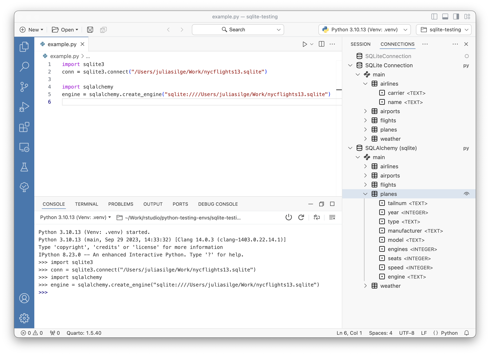{fig-align="center"}
:::

::::

::: footer
Positron docs | [Connections Pane](https://positron.posit.co/connections-pane.html)
:::


## Interactive Apps {.smaller}

:::: {.columns}

::: {.column width="35%"}
<br>
- Instead of running apps from a Terminal, Positron lets you run supported apps by clicking the <kbd>Play</kbd> button in Editor Actions
<br><br>
- [Supported apps include the following: Shiny, Dash, FastAPI, Flask, Gradio, and Streamlit]{.fragment .highlight-red}
<br><br>
- You can also start apps in Debug mode
:::

::: {.column width="65%"}
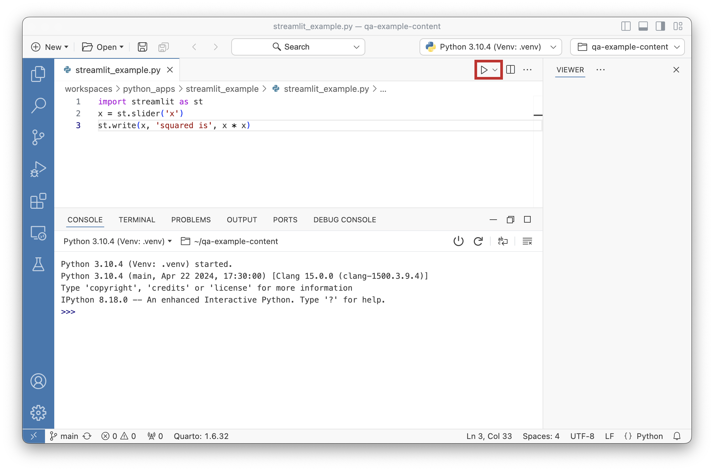{fig-align="center"}
:::

::::

::: footer
Positron docs | [Run Interactive Apps](https://positron.posit.co/run-interactive-apps.html)
:::

## Learn More about Positron 



::: footer
Visit Posit's new [Positron website](https://positron.posit.co) and their [YouTube channel](https://www.youtube.com/@PositPBC/videos) to learn more
:::

# Live Demo {background-color=''}

Let's see Positron in action!

## {.center background-color=''}

::: r-fit-text
*Thank you!* 🤍
:::

# questions? {.center background-color=''}

<br><br>

Connect with me!

- Personal Site: [JavierOrracaDeatcu.com](https://www.javierorracadeatcu.com/){style="color: black"}
- LinkedIn: [linkedin.com/in/orraca](https://www.linkedin.com/in/orraca/){style="color: black"}
