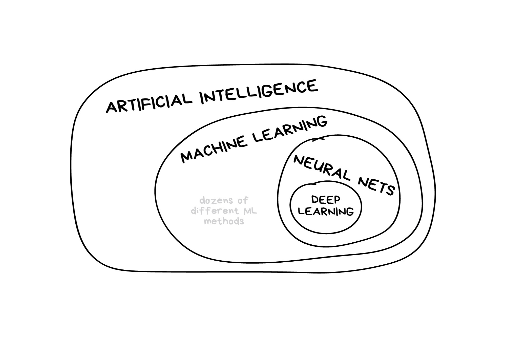
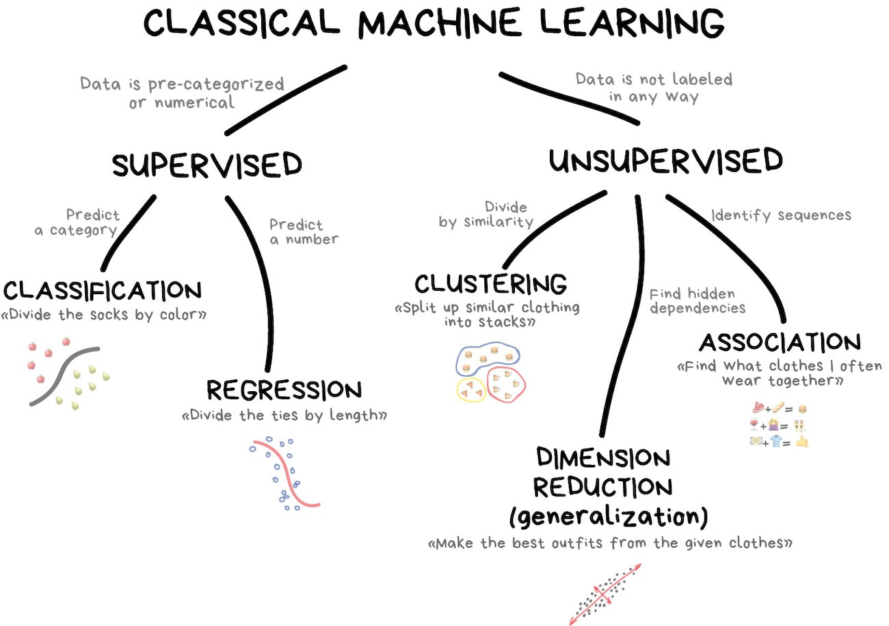
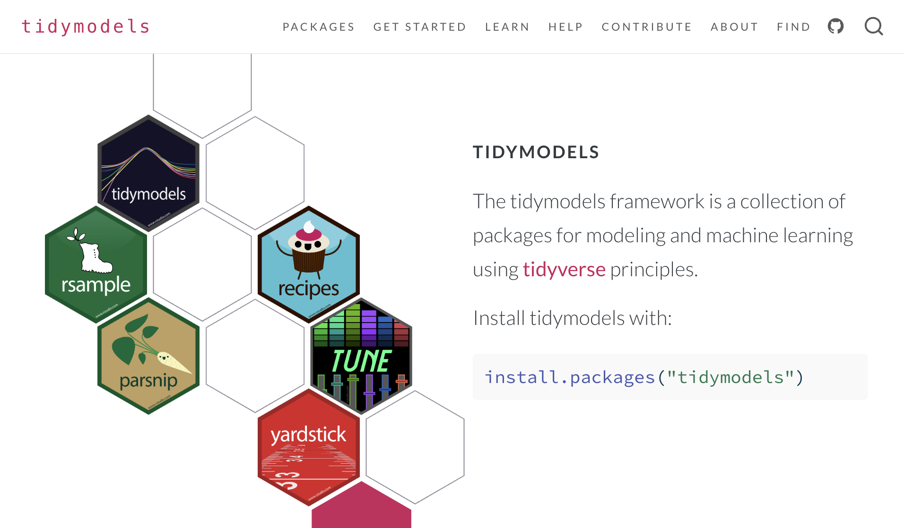
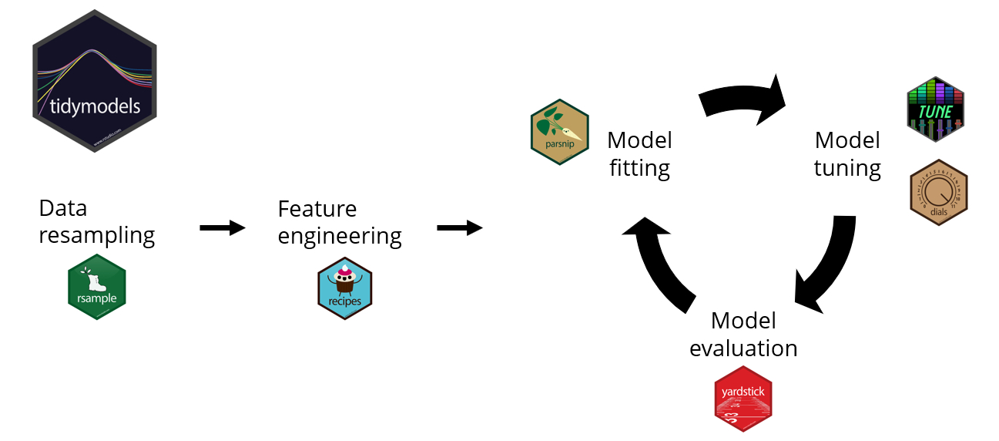

```{r}
#| echo: false
source(".Rprofile")
```

## {background-image="intro_to_tidymodels.png" background-size="contain" background-color="black"}

# About Me {background-color=''}

## Professional Background

💼 __Career__  
|- [EY](https://www.ey.com) - Manager, Valuation, Modeling, & Economics  
|- [PG&E](https://www.pgecorp.com) - Supervisor, Capital Recovery & Analysis  
|- [KPMG](https://www.kpmg.us) - Sr Manager, Economics & Valuation  
|- [Centene](https://www.centene.com) - Data Scientist III, Strategic Insights  
|- [Bloomreach](https://www.bloomreach.com) - Sr Manager, Data Ops & Analytics  
|- [Centene](https://www.centene.com) - Lead Machine Learning Engineer  
<br>
📚 __Education__<br>
|- [Georgia Tech](https://www.gatech.edu) - BS Management  
|- [UC Irvine](https://uci.edu) - MS Business Analytics  

::: footer
Personal Site: [JavierOrracaDeatcu.com](https://www.javierorracadeatcu.com/) | LinkedIn: [linkedin.com/in/orraca](https://www.linkedin.com/in/orraca/)
:::

## Technical Skills Gained

💼 __Career__  
|- [EY](https://www.ey.com) - Microsoft Excel, Microsoft Access, Financial Modeling  
|- [PG&E](https://www.pgecorp.com) - SQL, ODBC (connecting Access / Excel to EDWs)  
|- [KPMG](https://www.kpmg.us) - VBA scripting, Excel add-ins (Power Query and Power BI)
|- [Centene](https://www.centene.com) - R, Web Apps, Package Dev, ML / AI, Cloud DS Tools  
|- [Bloomreach](https://www.bloomreach.com) - GCP, Amazon Redshift, Linux, Google Workspaces  
|- [Centene](https://www.centene.com) - Docker, k8s, Databricks, Linux, bash, GenAI + LLMs   
<br>
📚 __Education__<br>
|- [Georgia Tech](https://www.gatech.edu) - Finance, Business Management  
|- [UC Irvine](https://uci.edu) - Business Analytics, Data Science  

::: footer
Personal Site: [JavierOrracaDeatcu.com](https://www.javierorracadeatcu.com/) | LinkedIn: [linkedin.com/in/orraca](https://www.linkedin.com/in/orraca/)
:::

# Data Science Issues {background-color=''}

## AI... It's an umbrella

{fig-align="center"}

::: footer
Image credit: <https://vas3k.com/blog/machine_learning>
:::

## AI... It's a _growing_ umbrella

{fig-align="center"}

::: footer
Image credit: <https://vas3k.com/blog/machine_learning>
:::

## Classical ML... _Another_ umbrella

{fig-align="center"}

::: footer
Image credit: <https://vas3k.com/blog/machine_learning>
:::

## ML Issues

- How should I measure my baseline?

- Which ML algorithm(s) should I use?

- How should I split my training and testing data?

- How should I evaluate my model fit?

- Which performance evaluation metric(s) should I use?

- Every ML package has a unique set functions and arguments

## {.center}

::: r-fit-text
and the most annoying issue...
:::

## {.center background-color="black"}

::: r-fit-text
data
:::

## {.center background-color="black"}

::: r-fit-text
sucks!
:::

## Data sucks!

- Missing data (NAs, nulls, etc.)
  - You may need to impute missing values

. . .

- Categorical variables
  - ML algorithms might require dummy or one-hot encoding

. . .

- Data type issues
  - For example, character strings and numbers in the same column

. . .

- Too many variables

# About Tidymodels {background-color=''}

## What is Tidymodels?

{width="80%" height="80%" fig-align="center"}

::: footer
Learn more about Tidymodels at [tidymodels.org](https://www.tidymodels.org)
:::

## What is Tidymodels?

- A collection of [R packages for reproducible ML]{.fragment .highlight-red}
<br><br>
- Follows tidy principles:
  - Consistent interface
  - Human-readable code
  - Reproducible workflows
<br><br>
- Provides a [unified syntax for ML]{.fragment .highlight-red}

::: footer
Learn more about Tidymodels at [tidymodels.org](https://www.tidymodels.org)
:::

## The ML Workflow (with Tidymodels)

{width="90%" height="90%" fig-align="center"}

::: footer
Image credit: Chen Xing's [Tidymodels Ecosystem Tutorial](https://rpubs.com/chenx/tidymodels_tutorial)
:::

## Let's Build a Binary Classification Model! {.smaller}

<br><br>
Our tidymodels workflow will follow the steps below:
<br><br>

:::: {.columns}
::: {.column width="50%"}
  0. Load libraries & data
  1. Split data
  2. Create recipe
  3. Specify model
  4. Create workflow
  5. Train model
  6. Evaluate performance
  7. Visualize performance
:::

::: {.column width="50%"}
  8. Setup for tuning
  9. Create CV folds
  10. Define the tuning grid
  11. Tune the model
  12. Visualize tuning results
  13. Select the best model
  14. Final fit
  15. Variable importance
:::
::::

## The Big Picture: Logistic Regression

- [**Logistic Regression Overview**]{.fragment .highlight-red}: Logistic regression is a statistical method that uses the logistic (sigmoid) function to model the probability of a binary outcome based on predictor variables (in our example, 1 = survived, 0 = did not survive)

- [**Titanic Model Application**]{.fragment .highlight-red}: In our case, age is one of the predictors to estimate a passenger's likelihood of surviving the Titanic

- [**Interpreting the S-Curve**]{{.fragment .highlight-red}}: The S-shaped curve shows how the probability of survival changes smoothly from low to high (or vice versa) as age varies, highlighting a gradual transition rather than a sudden jump between outcomes.

## The Big Picture: Logistic Regression

```{r}
#| echo: false

# Sample dataset: simulated binary outcome based on predictor x
set.seed(123)
n <- 50
x <- seq(-10, 10, length.out = n)
# Generate probabilities using the logistic function
prob <- 1 / (1 + exp(-x))
# Create binary outcomes using the probabilities
y <- rbinom(n, size = 1, prob = prob)
data <- data.frame(x = x, y = y)

library(ggplot2)
ggplot(data, aes(x = x, y = y)) +
  geom_point(alpha = 0.6, color = "red") + 
  stat_smooth(method = "glm", 
              method.args = list(family = "binomial"), 
              se = FALSE, color = "blue") +
  labs(title = "Titanic Survival Probability by Age",
       x = "Predictor: Age",
       y = "Probability of Survival") +
  scale_x_continuous(breaks = c(-10, -5, 0, 5, 10),
                     labels = c("80", "60", "40", "20", "0"))
```

## The Big Picture: `glm()` setup

:::: {.columns}

::: {.column width="49%"}

*base R's `glm()`*

```{r}
#| eval: false
#| echo: true

# Convert certain variables to factors to treat as categorical
titanic$Survived <- as.factor(titanic$Survived)
titanic$Pclass <- as.factor(titanic$Pclass)
titanic$Sex <- as.factor(titanic$Sex)

# Impute missing values for Age and Fare with their respective means
titanic$Age[is.na(titanic$Age)]   <- mean(titanic$Age, na.rm = TRUE)
titanic$Fare[is.na(titanic$Fare)] <- mean(titanic$Fare, na.rm = TRUE)

# Fit the logistic regression model
titanic_fit <- glm(Survived ~ Pclass + Sex + Age + SibSp + Parch + Fare, 
                   data = titanic, 
                   family = binomial)

# Display the summary of the model to inspect coefficients and significance
summary(titanic_fit)
```

:::

::: {.column width="2%"}
:::

::: {.column width="49%"}

*tidymodels `set_engine("glm")`*

```{r}
#| eval: false
#| echo: true

# Convert relevant variables to factors
titanic <- titanic |> 
  mutate(Survived = factor(Survived))

# Setup recipe
titanic_recipe <- recipe(Survived ~ Pclass + Sex + Age + SibSp + Parch + Fare, 
                         data = titanic) |> 
  step_impute_mean(all_numeric_predictors()) |> 
  step_dummy(all_nominal_predictors())

# Setup model specification and workflow pipeline
logistic_spec <- logistic_reg() |> 
  set_engine("glm") |> 
  set_mode("classification")

titanic_workflow <- workflow() |> 
  add_recipe(titanic_recipe) |> 
  add_model(logistic_spec)

titanic_fit <- titanic_workflow |> 
  fit(data = titanic)
```
:::

::::

## The Big Picture: glmnet

:::: {.columns}

::: {.column width="49%"}

*R's `{glmnet}`*

```{r}
#| eval: false
#| echo: true

# Convert certain variables to factors to treat as categorical
titanic$Survived <- as.factor(titanic$Survived)
titanic$Pclass <- as.factor(titanic$Pclass)
titanic$Sex <- as.factor(titanic$Sex)

# Impute missing values for Age and Fare with their respective means
titanic$Age[is.na(titanic$Age)]   <- mean(titanic$Age, na.rm = TRUE)
titanic$Fare[is.na(titanic$Fare)] <- mean(titanic$Fare, na.rm = TRUE)

# Create a design matrix for predictors
### model.matrix() automatically handles factors by creating dummy variables
### Remove the intercept column (first column) with [,-1] because {glmnet} includes it by default
x <- model.matrix(Survived ~ Pclass + Sex + Age + SibSp + Parch + Fare,
                  data = titanic)[, -1]

# Create the response vector
y <- titanic$Survived

# Fit the logistic regression model using glmnet (for a range of lambda values)
glmnet_fit <- glmnet(x, y, family = "binomial")
```

:::

::: {.column width="2%"}
:::

::: {.column width="49%"}

*tidymodels `set_engine("glmnet")`*

```{r}
#| eval: false
#| echo: true

# Convert relevant variables to factors
titanic <- titanic |> 
  mutate(Survived = factor(Survived))

# Setup recipe
titanic_recipe <- recipe(Survived ~ Pclass + Sex + Age + SibSp + Parch + Fare, 
                         data = titanic) |> 
  step_impute_mean(all_numeric_predictors()) |> 
  step_dummy(all_nominal_predictors())

# Setup model specification and workflow pipeline
glmnet_spec <- logistic_reg() |> 
  set_engine("glmnet") |> 
  set_mode("classification")

titanic_workflow <- workflow() |> 
  add_recipe(titanic_recipe) |> 
  add_model(glmnet_spec)

titanic_fit <- titanic_workflow |> 
  fit(data = titanic)
```
:::

::::

## Step 0: Load Libraries & Data {auto-animate="true"}

Prediction problem: Predict survival of Titanic passengers 

```{r}
#| echo: true
#| eval: false
#| code-line-numbers: "1-10|9"

# Load necessary packages
library(tidyverse)
library(tidymodels)
library(titanic)

# Load and prepare data
data(titanic_train)
titanic_data <- as_tibble(titanic_train) |> 
  mutate(Survived = factor(Survived, levels = c(0, 1)))

```

## Step 0: Load Libraries & Data {auto-animate="true"}

Prediction problem: Predict survival of Titanic passengers 

```{r}
#| echo: true

# Load necessary packages
library(tidyverse)
library(tidymodels)
library(titanic)

# Load and prepare data
data(titanic_train)
titanic_data <- as_tibble(titanic_train) |> 
  mutate(Survived = factor(Survived, levels = c(0, 1)))  # Convert target variable to a factor level

# Take a look at the data
glimpse(titanic_data)
```

## Step 1a: Split the Data

```{r}
#| echo: true

# Split the data (create a singular object containing training and testing splits)
set.seed(123)
titanic_split <- initial_split(
  data = titanic_data, 
  prop = 0.75, 
  strata = Survived # stratify split by Survived column
)

# Create training and testing datasets
train_data <- training(titanic_split)
test_data <- testing(titanic_split)
```

## Step 1b: Take a `glimpse()` at the splits

```{r}
#| echo: true

# Use dplyr::glimpse() to review the training split
glimpse(train_data)
```

## Step 1c: Check the Stratification

```{r}
#| echo: true

# Review the proportion of 0s and 1s in each split
train_data |> 
  summarise(Train_Rows = n(), .by = Survived) |> 
  mutate(Train_Percent = Train_Rows / sum(Train_Rows)) |> 
  left_join(test_data |> 
    summarise(Test_Rows = n(), .by = Survived) |> 
    mutate(Test_Percent = Test_Rows / sum(Test_Rows)),
  join_by(Survived))
```

## Step 2: Create a Modeling Recipe

```{r}
#| echo: true

# Create a pre-processing recipe
titanic_recipe <- recipe(Survived ~ Pclass + Sex + Age + SibSp + Parch + Fare, 
                         data = train_data) |>
  step_impute_median(all_numeric_predictors()) |>         # Handle missing values in Age
  step_dummy(all_nominal_predictors()) |>  # Convert categorical variables to dummy variables
  step_normalize(all_numeric_predictors()) # Normalize numeric predictors

titanic_recipe
```

## Step 3: Specify the Model

With `{parsnip}`, you have a unified interface for ML:

```{r}
#| echo: true

# Specify a logistic regression model
log_model <- logistic_reg() |>
  set_engine("glm") |>
  set_mode("classification")

log_model
```

## Step 4: Create a Workflow

```{r}
#| echo: true

# Create a workflow
titanic_workflow <- workflow() |>
  add_recipe(titanic_recipe) |>
  add_model(log_model)

titanic_workflow
```

## Step 5: Train the Model

```{r}
#| echo: true

# Fit the workflow to the training data
titanic_fit <- titanic_workflow |> 
  last_fit(
    split = titanic_split, 
    metrics = metric_set(roc_auc, accuracy)
  )

titanic_fit
```

## Step 6: Evaluate the Model

```{r}
#| echo: true

# Collect metrics from the `last_fit()` model object
collect_metrics(titanic_fit)
```

## Step 7: Visualize Model Performance

```{r}
#| echo: true

# Plot confusion matrix
titanic_fit |>
  collect_predictions() |> 
  conf_mat(truth = Survived, estimate = .pred_class) |> 
  autoplot(type = "heatmap")
```

## Step 8: Hyperparameter Tuning

Let's try modeling with `{glmnet}` and tuning

```{r}
#| echo: true

# Create a tunable model specification
log_model_tune <- logistic_reg(
  penalty = tune(),
  mixture = tune()
) |>
  set_engine("glmnet") |>
  set_mode("classification")

# Create a tuning workflow
tune_workflow <- workflow() |>
  add_recipe(titanic_recipe) |>
  add_model(log_model_tune)
```

## Step 9: Create Cross-Validation Folds

```{r}
#| echo: true


# Create cross-validation folds
set.seed(234)
titanic_folds <- vfold_cv(train_data, v = 5, strata = Survived)

titanic_folds
```

## Step 10: Define the Tuning Grid

```{r}
#| echo: true

# Create a grid of hyperparameters to try
log_grid <- grid_latin_hypercube(
  penalty(),
  mixture(),
  size = 100
)

log_grid
```

## Step 11: Tune the Model

```{r}
#| echo: true

# Tune the model
set.seed(345)
log_tuning_results <- tune_grid(
  tune_workflow,
  resamples = titanic_folds,
  grid = log_grid,
  metrics = metric_set(roc_auc, accuracy)
)

log_tuning_results
```

## Step 12: Visualize Tuning Results

```{r}
#| echo: true

# Show the best models
show_best(log_tuning_results, metric = "roc_auc")
```

## Step 12: Visualize Tuning Results (cont.)

```{r}
#| echo: true

# Create a visualization of the tuning results
autoplot(log_tuning_results)
```

## Step 13: Select the Best Model

```{r}
#| echo: true

# Select the best hyperparameters
best_params <- select_best(log_tuning_results, metric = "roc_auc")

best_params
```

```{r}
#| echo: true

# Finalize the workflow with the best parameters
final_workflow <- finalize_workflow(tune_workflow, best_params)
```

## Step 14: Final Fit

```{r}
#| echo: true

# Fit the final model to the entire training set and evaluate on test set
final_fit <- final_workflow |>
  last_fit(titanic_split)

# Get the metrics
collect_metrics(final_fit)
```

## Step 15: Variable Importance

```{r}
#| echo: true

# Extract the fitted workflow
fitted_workflow <- final_fit |>
  extract_workflow()

# Extract the fitted model
fitted_model <- fitted_workflow |>
  extract_fit_parsnip()

# Calculate variable importance
vip::vip(fitted_model)
```

## Tidymodels Benefits

- **Consistent Interface**: Same syntax across different ML algorithms
- **Modularity**: Each step is a separate function that can be modified
- **Reproducibility**: Workflows capture the entire modeling process
- **Extensibility**: Easy to add new steps or algorithms
- **Visualization**: Built-in tools for visualizing results
- **Tuning**: Streamlined process for hyperparameter optimization

# About Positron

Let's see a live demo of Positron!

## {.center background-color=''}

::: r-fit-text
*Thank you!* 🤍
:::

# questions? {.center background-color=''}

<br><br>

Connect with me!

- Personal Site: [JavierOrracaDeatcu.com](https://www.javierorracadeatcu.com/){style="color: black"}
- LinkedIn: [linkedin.com/in/orraca](https://www.linkedin.com/in/orraca/){style="color: black"}
